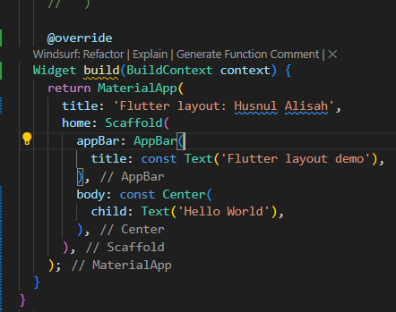
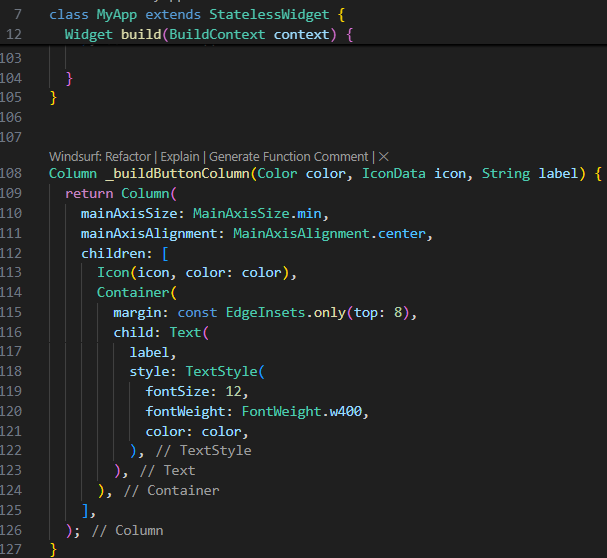

# layout_flutter

# 1: MEMBANGUNG LAYOUT DI FLUTTER

Buat project baru dengan  nama layout_flutter dan kemudian buka lib main.dart ganti, isi nama nim di bagian title nya

Kemudian ini hasilnya

Lalu Implementasi title row tambahkan kode seperti gambar di bawah di bagian atas metode build 

Berikut hasilnya

# 2: IMPLEMENTASI BUTTON ROW

Selanjutnya buat method Column_buildButtonColumn 

Kemudian membuat widget buttonSection dengan fungsi buildButtonColumn

Berikut hasilnya

# 3: IMPLEMENTASI TEXT SECTION

Selanjutnya buat widget textSection input teks ke dalam container Lalu tambahkan widget variable textSection ke dalam body

kemudian hasil dari di atas

# 4: IMPLEMENTASI IMAGE SECTION

Buat folder assets dan masukan foto yang akan di gunakan di folder assets, lalu set di file pubspec.yml

Langkah terahir atur elemen dalam LisView seperti gambar berikut

Berikut adalah hasilnya

